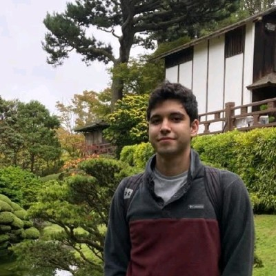

# Emilio Cantu-Cervini

I did my undergrad in Computer Engineering at [ITAM](https://itam.mx/) in Mexico City and am now pursuing a Master's in Applied Statistics at the University of Michigan.

::: {.column-margin}
{#pp}
:::

ecantuc[at]umich[dot]edu

[LinkedIn](https://www.linkedin.com/in/emilio-cantu-cervini-24b2541b6/) | [X](https://x.com/emiliocantuc) | [Github](https://github.com/emiliocantuc) | [Posts](posts)

Some of my favorite [book highlights](https://highlights.cervini.casa/)

## preprints
- E. Cantu-Cervini. *Personalized Federated Learning via Stacking*. [[arxiv](https://arxiv.org/abs/2404.10957)] [[code](https://github.com/emiliocantuc/personalized-fl-via-stacking/)]

## pet projects
- [Horarios ITAM](https://horariositam.com/): A schedule planner for ITAM undergrads with about 3k monthly visitors. [done]
- [Awesome Umich Orgs](https://emiliocantuc.github.io/awesome-umich-orgs): Explore similar student orgs by closest neighbors in embedding space. [done]
- [My Wolverine Events](https://mywolverine.events/): Get event recommendations from U of M (learning about recsys). [in dev]
- 

## posts

I've been trying to write as I learn about cs, stats, and ml. Here are the latest:

::: {#posts-listing}
:::

Read more [here](posts).