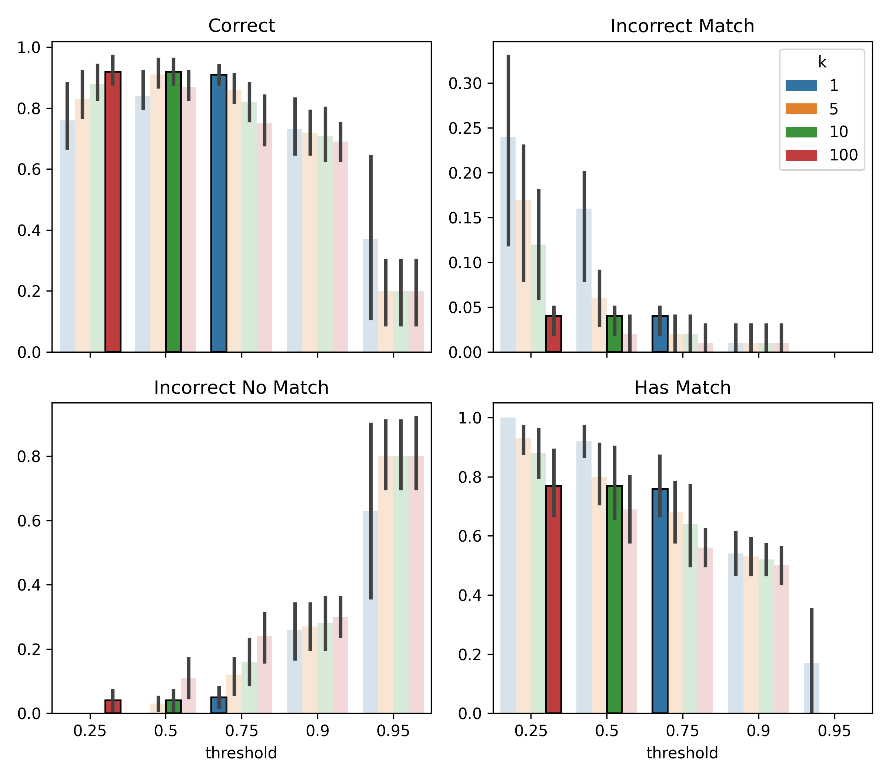

## Context

During my undergrad, I built a simple schedule planning [site](https://horariositam.com) for my university. By the third semester I'd grown tired of using excel and learned enough javascript to code up a site which ranked every possible schedule by my preferences. One of these was to upweight schedules based on professors' ratings extracted from a site like RateMyProfessor. 

This is where I first encountered fuzzy profile matching (also called record linkage, entity resolution, etc). Basically trying to decide if profiles in different databases refer to the same person. This came about because student reviewers create a professor's profile, which meant different names across sites:


| Nombre (School)    | Nombre (Review)      |
|---------------------|----------------------|
| Juan Pérez          | J. Perez             |
| María González      | Maria Glez           |
| Carlos Ramírez      | C. Ramirez           |


At the time I decided to link profiles using a very simple approach based on the normalized string similarity ([levenshtein ratio](https://www.digitalocean.com/community/tutorials/levenshtein-distance-python)) between names:

```python
def lev_ratio(a, b):
    return 1 - edit_dist(a, b) / (len(a)+len(b))

for n_a in school_names:
    for n_b in review_names:
        if lev_ratio(n_a, n_b) > 0.9:
            link(n_a, n_b)
            break
```

While this worked ok at the time, in retrospect it was a very bad approach for several reasons. Since a lot of students still use the site, I thought I could do better after 6 years and a master's in stats.


## How to do better

I thought I would simply:

1. Gather data by manually matching profiles. I need data to tune, but more importantly, evaluate the approach. 
2. Engineer features and train a pairwise binary classifier to predict the probability of a true match given two profiles. 
3. Use the pairwise classifier to predict matches (or 'no match') for every professor on the school's site. 

In all of these steps I encountered a few subtleties. I'll quickly go over these what I would have done differently or will improve in the future.

### Data

I spent a couple of hours manually matching 150 profiles, 100 for training and the rest for evaluation.  Professors on the school site either had one, multiple, or no matching profiles on the review site.

Note that since we only have manually annotated *matches*, our training set only contains positives. So how to generate negative $(\text{profile}_A, \text{profile}_B)$ pairs to train our classifier?


A naive option could be to set every pair that was not manually matched to negative and end up with $N_{school} \times (N_{review} - 1)$ negative pairs. However, I did not want to deal with the high class imbalance and opted for randomly sampling $k_\text{neg}$ of such pairs for every positive one. 

As we'll see below this worked alright. But most of the negatives were really "easy" since two randomly sampled profiles are likely to have wildly different names (and other features). Thus, this first approach will likely not perform very well on the rare but tough cases where truly distinct professors have similar features.

What I wished I had thought of before was using active learning. I could have collected a few matches (say 20 instead of 100), trained a model and used its predictions to find harder examples. To find them you can use low model confidence or a bunch of other heuristics ([doubtlab](https://github.com/koaning/doubtlab) has a bunch). After labelling a few of the hardest, you retrain and repeat (making sure to not overfit).

I think this approach could have saved me some labelling and resulted in higher quality negatives. I'll try to do the experiment sometime soon.

### Features & model

Besides the names from both platforms, I also included professors' departments:

| Nombre (S)    | Nombre (R)      | Depto (S) | Depto (R) |
|---------------------|----------------------|------------------------|-----------------------|
| Juan Pérez          | J. Perez             | Matemáticas, Actuaria            | Mate           |
| María González      | Maria Glez           | Física, Matemáticas                 | Mate                |
| Carlos Ramírez      | C. Ramirez           | Computación, Actuaria           | Compu           |

After playing around a little, I settled on using only two features for simplicity:

- A string similarity between the profile names. Went for [`token_sort_ratio`](https://rapidfuzz.github.io/RapidFuzz/Usage/fuzz.html#token-sort-ratio) since it handles missing words and is not sensitive to order. For example, "Juan Perez" and "J. Perez" score a perfect 1.
- A string similarity between the departments. Because a professor could have multiple school departments (extracted from the classes they give that semester) I simply took the maximum of the similarities ([`token_set_ratio`](https://rapidfuzz.github.io/RapidFuzz/Usage/fuzz.html#token-set-ratio) here). 


Keeping with the simplicity theme, the model was a logistic regressor. Later on it might be fun to train a character-level LLM or BERT model to see if they can beat these handcrafted features.

### Final matching

Once the pairwise classifier is trained, how do we use it to make matches? 

Should we do something similar to my previous approach from years ago?

```python
for prof_a in school_profiles:
    for prof_b in review_profiles:
        if model.predict_proba([prof_a, prof_b]) > 0.9:
            link(prof_a, prof_b)
            break
```

No. In hindsight this was terrible for a couple of reasons. First, I tuned the threshold by skimming the output since I didn't have any manually matched profiles. Second, we link to the *first* review profile above the threshold, not the highest. This is sensitive to ordering. A simple improvement and what I ended up using is to consider only the most probable predicted match:

```python
for prof_a in school_profiles:
    argmax_prof_b, max_prob = best_match(prof_a)
    if max_prob > threshold:
        link(prof_a, argmax_prof_b)
```

This is still not perfect since it's still possible to map two school profiles to the same review one. The more principled approach (I might get to later) is framing this as a bipartite graph matching problem. We have school profile nodes and review site nodes and the classifier's match probabilities as (potential) weighted edges between them. You can then choose the edges that maximize the total edge weights while respecting one-to-one constraints. 

## Results

We still have to tune the `threshold` and `k` (no. of negatives to sample per positive for training) parameters. I initially set them to 0.5 and 10 respectively, but in writing this I thought it would be nice to cross validate to see how good this guess was. 



You can see the tradeoffs. Bigger `k` means more negatives to train with, a bigger training set, but also greater class imbalance. Seeing a lot more negatives than positives makes the model less confident when predicting positives. Hence you can see than for the `k=100` model to achieve good performance we need to lower the threshold to `0.25`. 

The metrics we care about are inherently a trade-off, but I would say the initial guess (green) fared quite well. Two other configurations (blue and red) performed comparably, and the blue (0.75, 1) option could have saved a few seconds during training.

Anyway, the new method is better on our test set than what I implemented years ago:

| Metric     | New  | Previous |
|------------|-------|----------|
| Correct               | 0.9   | 0.82     |
| Incorrect match       | 0.04  | 0.04     |
| Incorrect no match    | 0.06  | 0.14     |
| Has Match             | 0.76  | 0.66     |


The deployed model now links about 74% of professors to a review profile, up from 60% before.


## Final thoughts

I had fun coming back to this site and fiddling around with a ML problem that is not just "standard" supervised learning. I tried tackling the problem without a literature review for fun, but this is obviously a studied problem. I should mention that since my datasets were pretty small (about 1k profiles each), I didn't run into the usual compute challenges. [Here](https://www.science.org/doi/10.1126/sciadv.abi8021) is a good overview survey if you are interested in what they are and how to alleviate them.